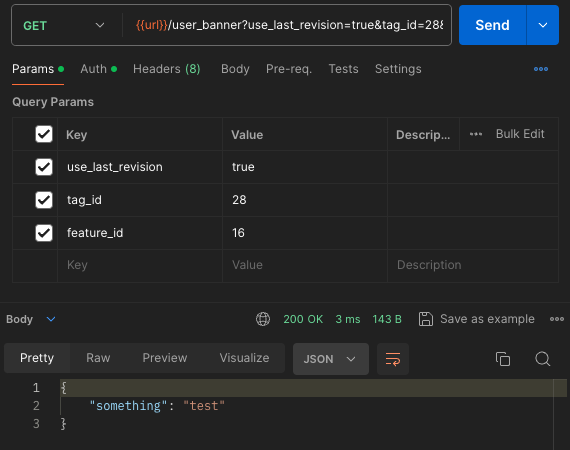

# Тестовое задание на стажировку в Авито

## Интрукция по командам в Makefile

Сборка и запуск executable локально
```sh
make run
```

Запуск через docker
```sh
make docker-up
```

Выключение docker
```sh
make docker-down
```

Очистка docker
```sh
make docker-rm
```

Запуск swagger-ui для файла из задания
```sh
make swagger-from-task
```

Запуск end-to-end тестов (через docker):
```sh
make e2e-tests
```

## Примеры запросов/ответов

### /auth/register


### /auth/login


### /banner

С токеном пользователя


С токеном админа


С фильтром


Изменим содержимое


Проверка того, что содержимое поменялось


Удалим баннер с id 2


Проверка, что баннер удалился


### /user_banner

Получение баннера


Изменим его содержимое


Информация старая, потому что сработало кеширование


Укажем флаг use_last_revision




## Вопросы/ответы

- Авторизация: решил не делать refresh токены, на это ушло бы много времени
- Во всех 500 ошибках решил не выдавать текст ошибки напрямую из api в целях безопасности
- Для выполнения отложенных трудоемких задач на удаление хотел реализовать worker pool, но не успел :(
- В базе данных во время patch были использованы транзации дабы баннер частично не обновлялся при частичной неудачи запросов к бд
- В swagger файле не было описано ситуации когда создание или обновление баннера может конфликтовать с уже имеющимся (т.к. баннеры должны быть уникально определены по tag_id и feature_id), добавил везде соответствующие статусы кодов
- Выбрал gin как router потому что он все еще проще чем встроенное решение, даже не смотря на последнюю версию go :)
- Для того чтобы избежать дубликатов данных в redis по разным ключам (tag_id и feature_id) я использовал еще один ключ с id баннера как промежуточый
